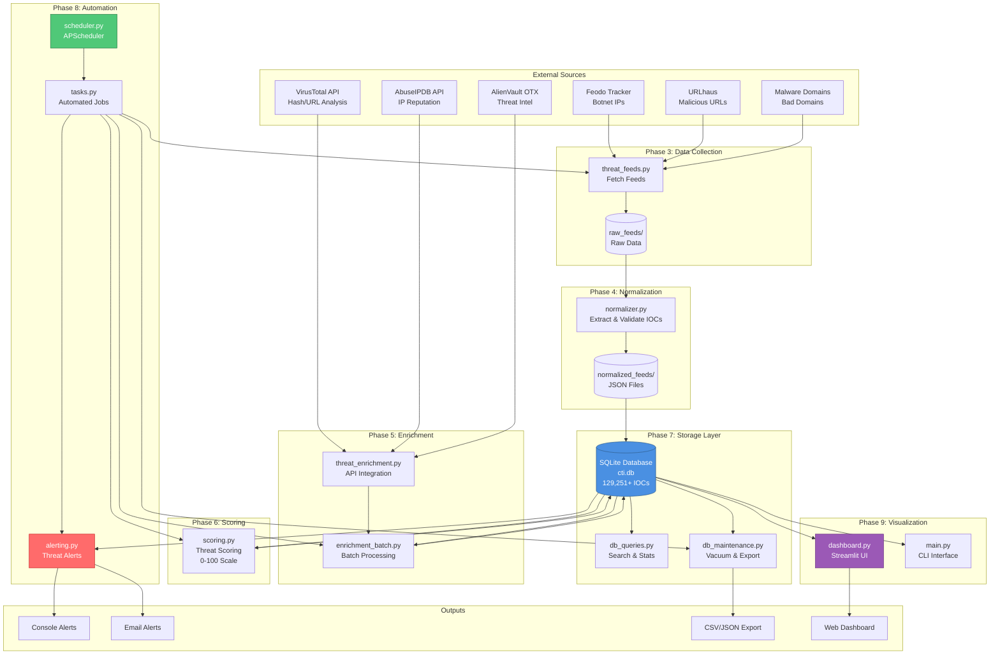
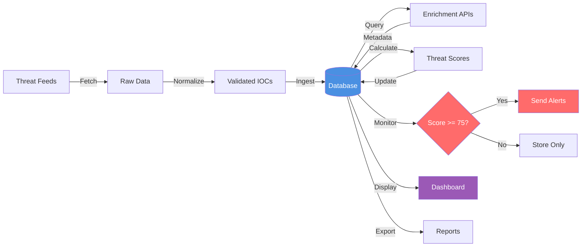
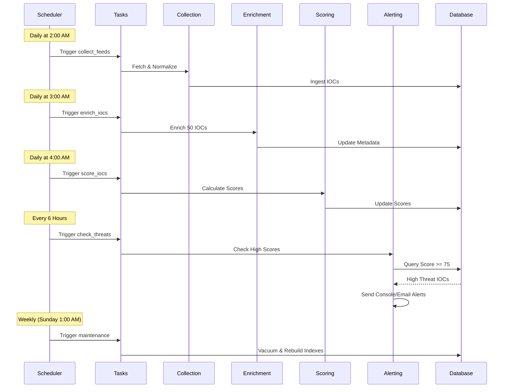
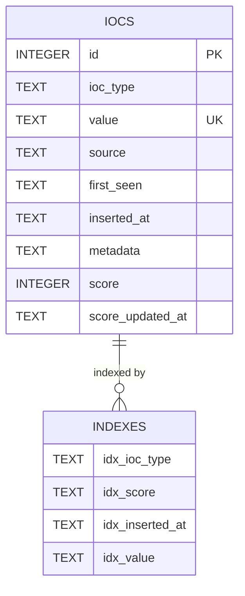
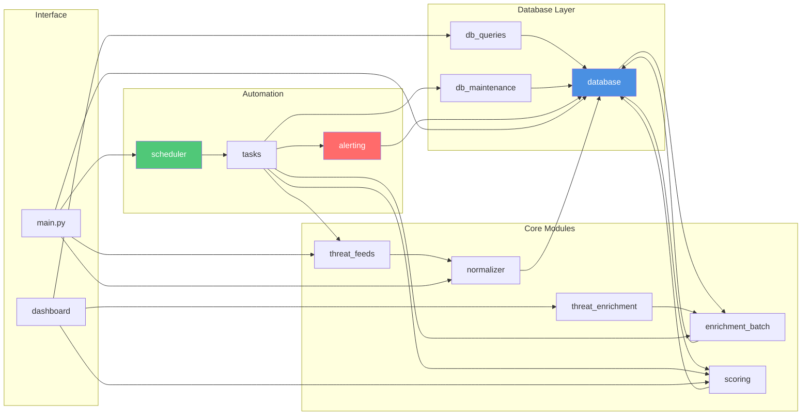
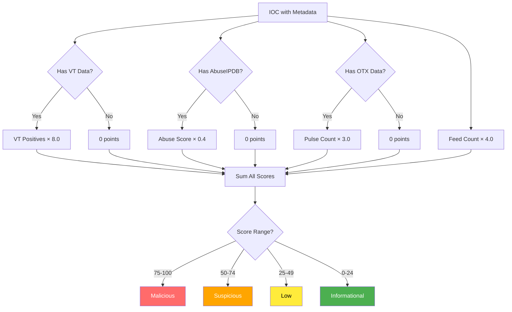
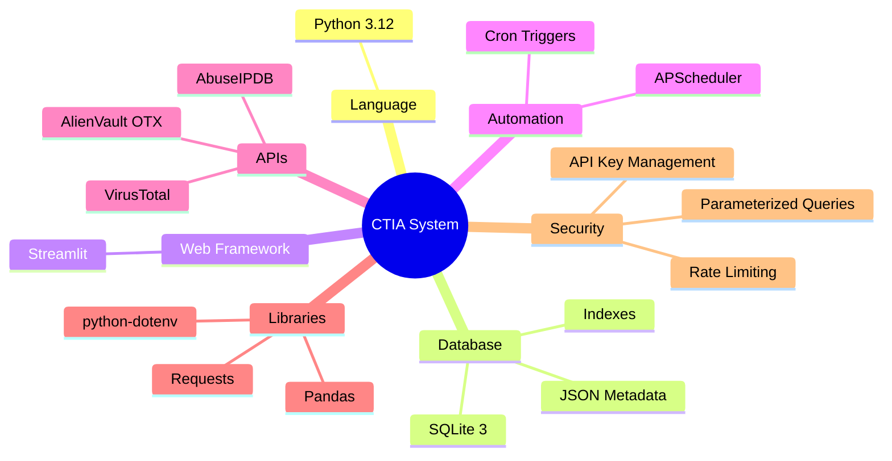
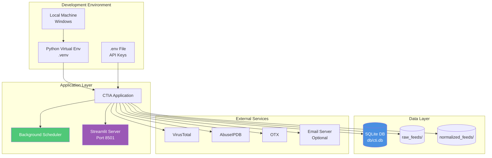

# CTIA System - Visual Architecture Diagram

## System Architecture Overview

## Data Flow Diagram

## Automation Workflow

## Database Schema

## Component Interaction Map

## Scoring Algorithm

## Technology Stack

## Deployment Architecture

---

## Legend

- **Blue**: Database/Storage components
- **Green**: Automation/Scheduling components
- **Red**: Alerting/Warning components
- **Purple**: User Interface components
- **Gray**: External services/APIs

---

## Notes

1. All diagrams are created using Mermaid syntax for easy rendering
2. Can be viewed in GitHub, VS Code (with Mermaid extension), or online at mermaid.live
3. Diagrams show complete system architecture from data collection to alerting
4. Automation workflow demonstrates the scheduled task execution flow
